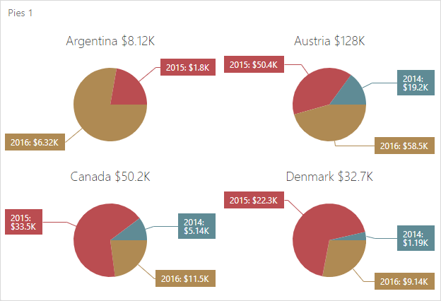

<!-- default badges list -->

<!-- default badges end -->

# Web Dashboard - How to Display the Total value above Each Pie Chart

This example demonstrates how to access the <a href="https://docs.devexpress.com/Dashboard/117573/web-dashboard/aspnet-web-forms-dashboard-control/access-to-underlying-widgets?p=netframework">Underlying Pie Widgets</a> used to display the Pie Item and configure their settings to display the Total value in the title.

Total values are calculated automatically if the <a href="https://docs.devexpress.com/Dashboard/DevExpress.DashboardWeb.ConfigureItemDataCalculationWebEventArgs.CalculateAllTotals">CalculateAllTotals</a> property is enabled using the <a href="https://docs.devexpress.com/Dashboard/DevExpress.DashboardWeb.ASPxDashboard.ConfigureItemDataCalculation?p=netframework">ConfigureItemDataCalculation</a> event. To get the total value, the client-side <a href="https://docs.devexpress.com/Dashboard/js-DevExpress.Dashboard.ItemWidgetBaseEventArgs#js_devexpress_dashboard_itemwidgetbaseeventargs_itemdata">ItemWidgetBaseEventArgs.itemData</a> property is used. 

## Files to Review

* [Default.aspx](./CS/ASPxDashboard/Default.aspx) (VB: [Default.aspx](./VB/ASPxDashboard/Default.aspx))
* [Default.aspx.cs](./CS/ASPxDashboard/Default.aspx.cs) (VB: [Default.aspx.vb](./VB/ASPxDashboard/Default.aspx.vb))
* [Global.asax](./CS/ASPxDashboard/Global.asax) (VB: [Global.asax](./VB/ASPxDashboard/Global.asax))
* [Global.asax.cs](./CS/ASPxDashboard/Global.asax.cs) (VB: [Global.asax.vb](./VB/ASPxDashboard/Global.asax.vb))

## Documentation

* [Obtaining Underlying and Displayed Data](https://docs.devexpress.com/Dashboard/403003/web-dashboard/dashboard-control-for-javascript-applications-jquery-knockout-etc/obtain-underlying-and-displayed-data?p=netframework)

## More Examples 

* [WinForms - How to display the Total value above each Pie Chart](https://github.com/DevExpress-Examples/how-to-display-the-total-value-above-each-pie-chart)
<!-- feedback -->
## Does this example address your development requirements/objectives?

 

(you will be redirected to DevExpress.com to submit your response)
<!-- feedback end -->
